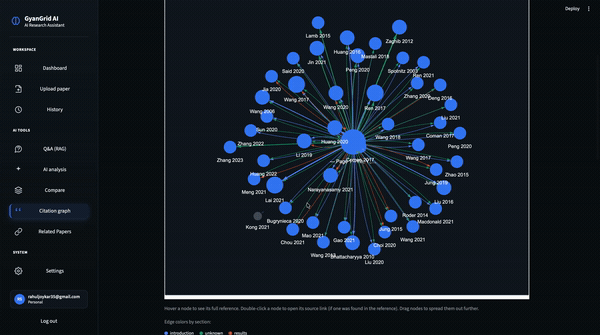
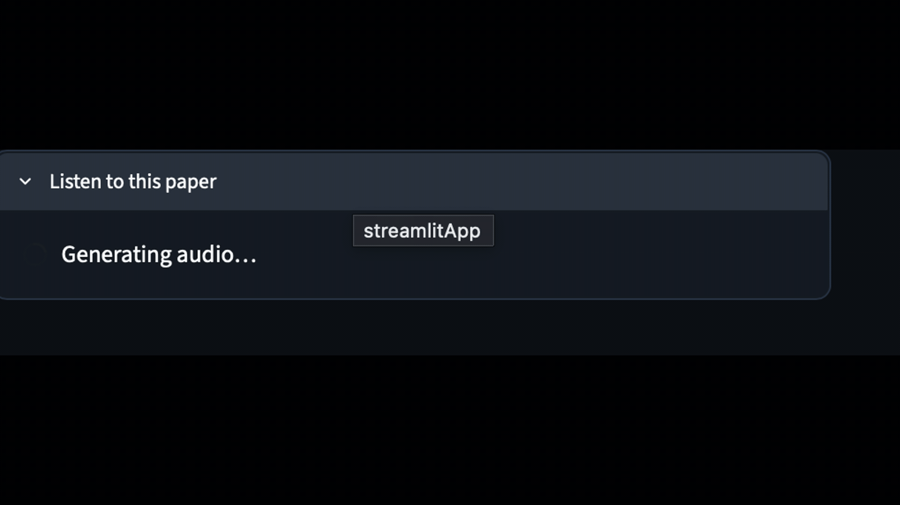

# GyanGrid AI

A full-stack research paper analysis tool built with Streamlit — search, understand, and organize academic papers through a RAG-powered assistant.




## Features

- 🔐 **Flexible Authentication** — email/password login, Google OAuth, Gmail-based OTP email verification for sign-up, and a "Continue without login" guest mode. Accounts and data are stored in Supabase.
- 📤 **Paper Upload** — PDF/DOCX up to 20MB, up to 3 papers tracked at once
- 📊 **Dashboard** — document overview per paper: character count, chunk count, sections found, section-aware chunks, and reference count
- 💬 **RAG-Powered Q&A** — ask grounded questions and get answers sourced directly from the paper, via FAISS + Google Gemini
- ✨ **AI Analysis** — auto-generated paper summary, key topics, research gaps, and likely reviewer questions; results include novelty, research gap, future work, conclusion summary, and core technology tags. Citation support and an AI readiness score are on the roadmap.
- 🆚 **Compare** — side-by-side comparison of two papers across novelty, research gap, methodology, results, future work, and conclusion, with an AI verdict summary (similarity %, better novelty/methodology/results, future potential, overall winner)
- 🔗 **Related Papers Discovery** — surfaces relevant academic papers via OpenAlex and Semantic Scholar APIs
- 🕸️ **Citation Graph** — visualize citation relationships
- 🔊 **Text-to-Speech** — listen to paper summaries via gTTS
- 📄 **PDF Export** — export analysis and notes to PDF via LibreOffice
- 📜 **History** — revisit and reopen previously uploaded papers

## Tech Stack

| Layer | Technology |
|---|---|
| Frontend/App | Streamlit |
| Vector Search | FAISS |
| LLM / RAG | Google Gemini |
| Auth & DB | Supabase |
| Paper Metadata | OpenAlex API, Semantic Scholar API |
| Text-to-Speech | gTTS |
| PDF Export | LibreOffice |

## Live Demo

Deployed on Streamlit Community Cloud — [add your live link here]

## Getting Started

### Prerequisites

- Python 3.9+
- A Supabase project (URL + API key)
- A Google Gemini API key

### Installation

```bash
git clone https://github.com/<your-username>/gyangrid-ai.git
cd gyangrid-ai
pip install -r requirements.txt
```

### Environment Variables

Create a `.env` file:

```
SUPABASE_URL=your_supabase_url
SUPABASE_KEY=your_supabase_key
GEMINI_API_KEY=your_gemini_api_key
```

### Run Locally

```bash
streamlit run app.py
```

## Roadmap

- [ ] Citation Support (verified in-text citations cross-checked against source references)
- [ ] AI Readiness Score (how well-structured a paper is for automated analysis)
- [ ] Multi-language paper summarization

## License

[Add your license here, e.g. MIT]

## Author

**Rahul Chandra Shil**
[LinkedIn](#) · [GitHub](#)